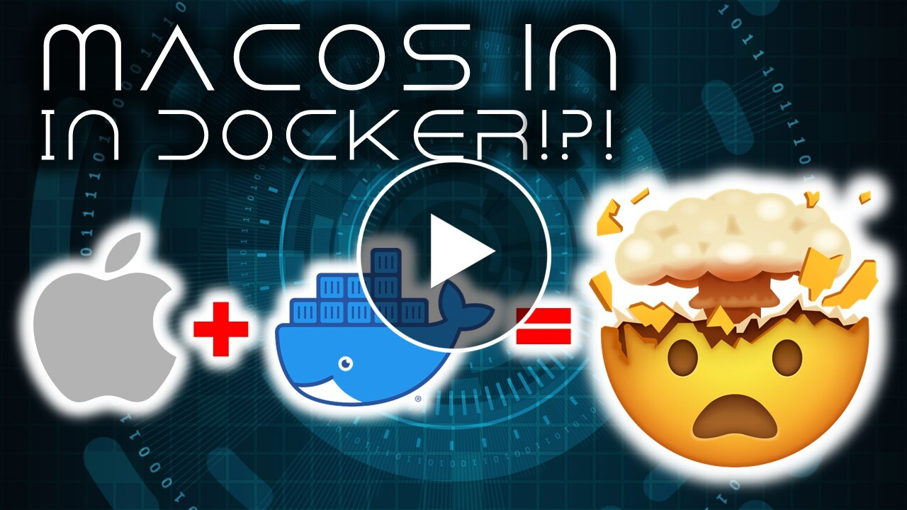

# Run a MacOS (OSX) Virtual Machine in a Docker Container

This little project is adapted from https://github.com/kholia/OSX-KVM, a great build for running MacOS/OSX in a container.

To run this, either build the image from this source or run it from the online repo.

`docker run -p 8081:8080 --device /dev/kvm blaize/macos-docker`

This container can take several inputs for environment variables. You can add these by using the -e flag.

`docker run -p 8081:8080  -e OSXVERSION=big-sur --device /dev/kvm blaize/macos-docker`

* `OSXVERSION` -- Default is big-sur. You can select high-sierra, mojave, catalina, big-sur, monterey, or ventura
* `DISKSIZE` -- Default is 128G. The size of the disk 64G, 128G etc. 
* `ALLOCATED_RAM` -- Default is 7192. You can use any number, but greater than 4096 is recommended.
* `CPU_SOCKETS` -- Default is 1. 
* `CPU_CORES` -- Default is 2. 2 or greater is recommended. 
* `CPU_THREADS` -- Default is 4. 4 or more is recommended.

Enjoy your VM.
